# LR6
Лабораторная работа №6
## Система контроля версий (Git)
### **Студент:** 4441в Иванов В.С.

---
## Цель работы
Изучение базовых возможностей системы управления версиями Git, получение опыта работы с Git API, освоение работы с локальными и удалёнными репозиториями, а также оформление отчёта с использованием Markdown.

---

# Порядок выполнения работы
# 1. Создание аккаунта и Fork репозитория

Создан аккаунт на GitHub и сделан Fork репозитория [Kurtyanik/LR6](https://github.com/Kurtyanik/LR6).

---

# 2. Установка Git и первичная настройка

## Был установлен Git

## Были произведены настройка имени и email

git config --global user.name "4441в Иванов В.С."
git config --global user.email "portrava21@gmail.com"
git config --list

---

# 3. Клонирование удалённого репозитория

git clone https://github.com/portraffed/LR6.git
cd LR6
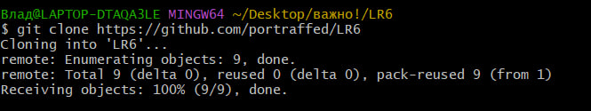

---

# 4. Создание файла через GitHub и подтягивание изменений

## Создан новый файл через веб-интерфейс GitHub и сделан Commit.

git pull

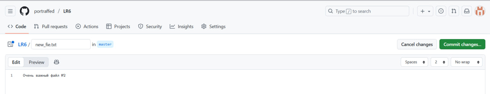
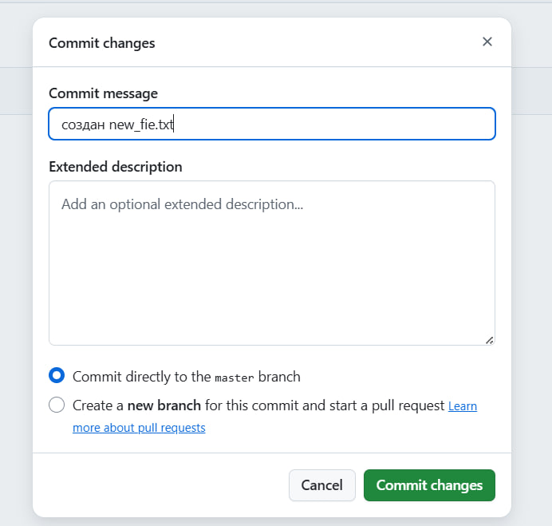
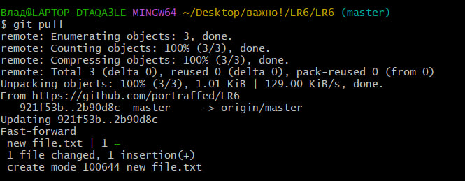

---
# 5. Получить историю операций для каждой из веток
git log

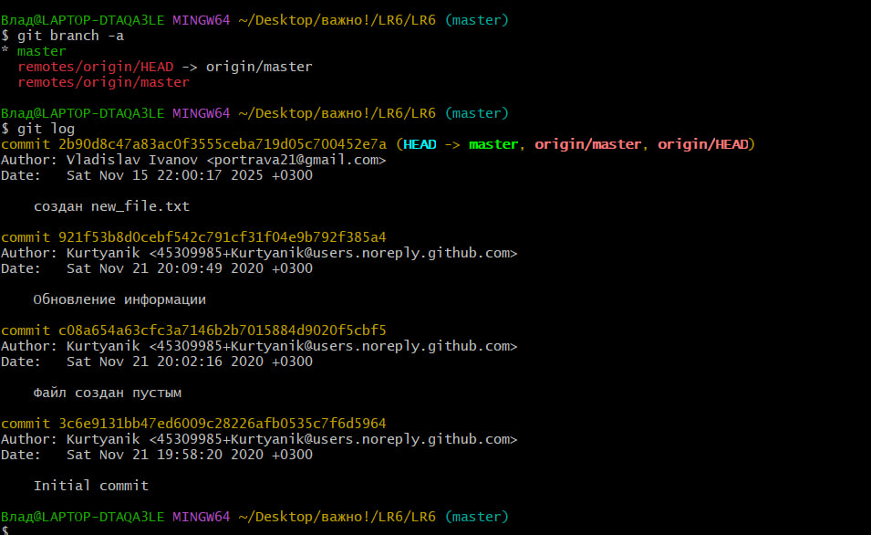

---

# 6. Просмотреть последние изменения
git status

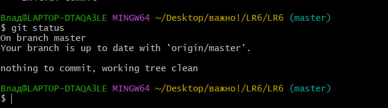

---

# 7. Выполнить слияние в ветку master и разрешить конфликт

## Была создана новая ветка, в файл new_file.txt были внесены изменения
## Затем другие изменения были произведены из ветки Master
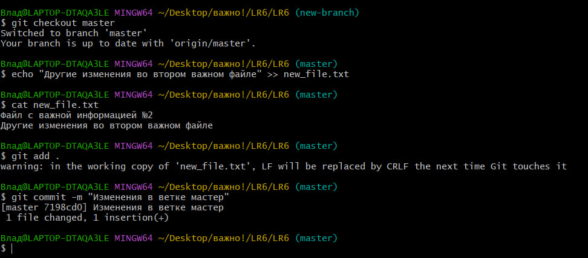
## Попытка слияния неуспешна
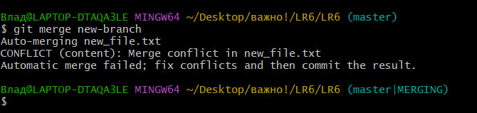
## После исправления конфликта слияние успешно, ветка удалена
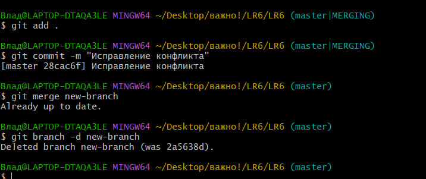

# 8. Сделать изменения и зафиксировать их несколько раз с комментариями

## Были произведены изменения в файле new_file.txt, затем произведены коммиты

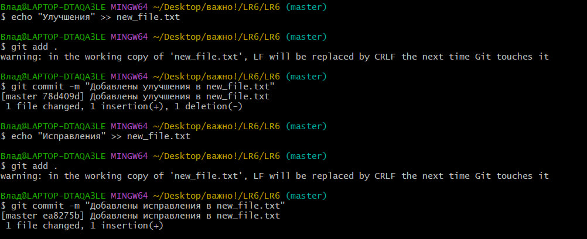

# 9. Сделать откат коммита 

## Произведен откат коммта

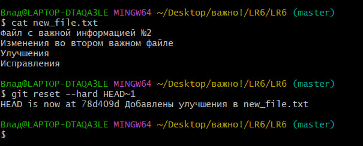

---

# 10. Создать ветку для отчёта 
## Создана ветка для отчета git checkout -b report 

![Создание ветки для отчёта]screenshots/(12_report_branch.jpg)

---

# 11. Получить историю операций в форматированном виде (сокращённый хэш + дата + имя автора + комментарий)
$ git log --pretty=format:"%h | %ad | %an | %s" --date=short
27362aa | 2025-11-15 | 4441в Иванов В.С. | Создание отчета
5415675 | 2025-11-15 | 4441в Иванов В.С. | Испрвлено форматирование в new_file.txt
78d409d | 2025-11-15 | 4441в Иванов В.С. | Добавлены улучшения в new_file.txt
28cac6f | 2025-11-15 | 4441в Иванов В.С. | Исправление конфликта
7198cd0 | 2025-11-15 | 4441в Иванов В.С. | Изменения в ветке мастер
2a5638d | 2025-11-15 | 4441в Иванов В.С. | Изменения в новой ветке
2b90d8c | 2025-11-15 | Vladislav Ivanov | создан new_file.txt
921f53b | 2020-11-21 | Kurtyanik | Обновление информации
c08a654 | 2020-11-21 | Kurtyanik | Файл создан пустым
3c6e913 | 2020-11-21 | Kurtyanik | Initial commit

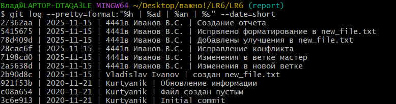

---

# 12. Отправить локальные изменения в сетевое хранилище GitHub
git push origin report